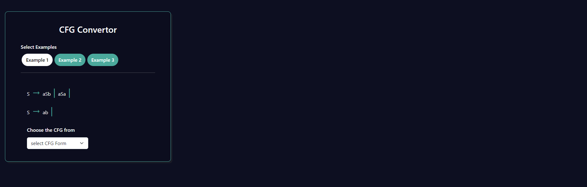
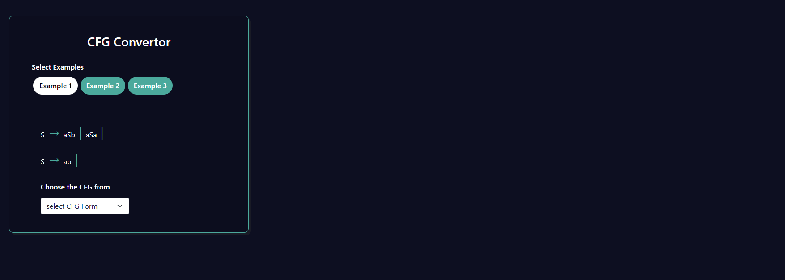
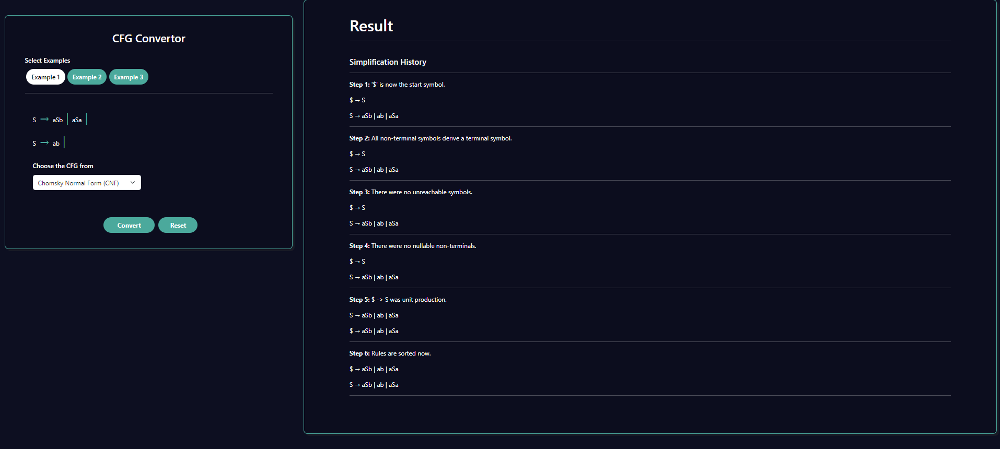

<h5>Procedure</h5>

The primary objective of this experiment is to understand  how Context-Free Grammars can be  converted into equivalent forms. 

Start with selecting the examples given as input .

 Upon selecting the examples the production of the Grammars will be  visible 

choose between one of the options provided to convert it into either GNF or CNF 

click on the convert button to view the simplifeied Grammars and  their detailed steps 

