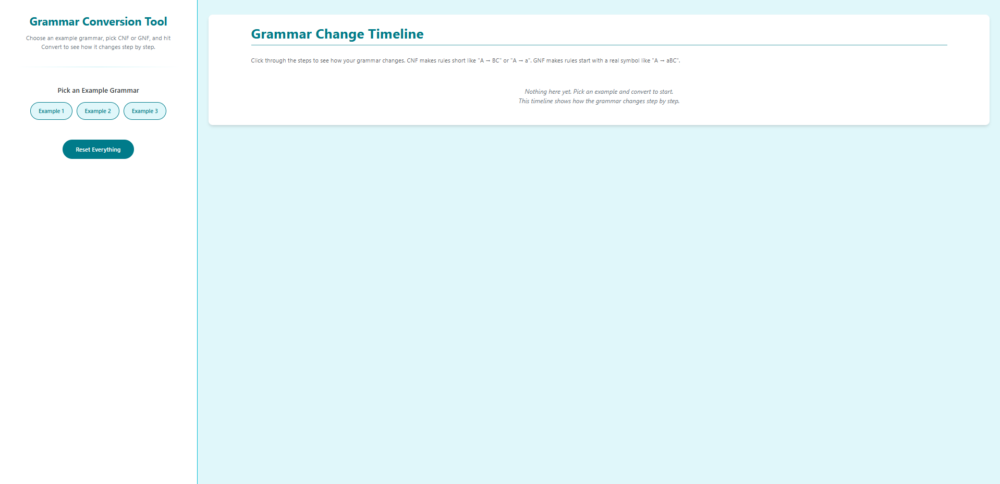
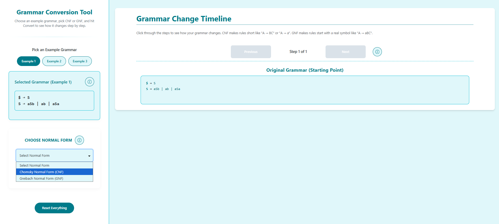
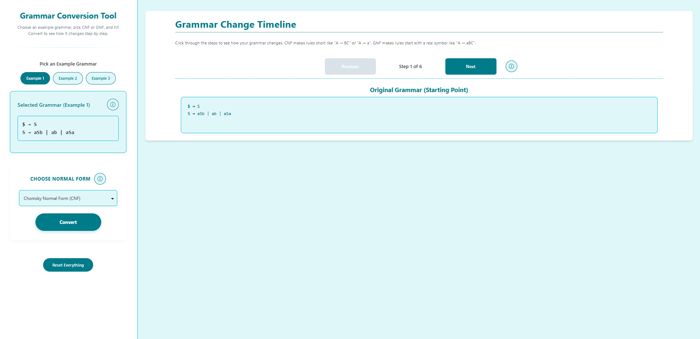

#### Step 1 — Select an Example
1. Open the **CFG Conversion Simulator**.
2. Navigate to **Select an Example Grammar**.

#### Step 2 — Choose an Example Grammar
1. Click on one of the example buttons: **Example 1**, **Example 2**, or **Example 3**.
2. The **Original Grammar** panel will populate with the selected grammar.

##### Step 3 — Pick a Conversion Form
1. In **Pick a Normal Form for Conversion**, choose one of the following:
   - **Chomsky Normal Form (CNF)**
   - **Greibach Normal Form (GNF)**
2. The conversion panel updates to reflect your selection.
3. If your UI has a **Convert** button, click it to start the conversion.

#### Step 4 — Step Through the Grammar Conversion
1. In the **Grammar Conversion Simulator** panel, use the **Next** button to progress through each transformation step.
2. Use **Previous** to go back if needed.
3. Follow the **“Step X of N”** indicator until the final step is reached.

#### Step 5 — View Final Converted Grammar
1. At the last step, compare the two panels:
   - **Final Converted Grammar**: grammar after conversion to the chosen normal form.
   - **Original Grammar**: grammar you started with.
2. Review the **example strings** generated for each to verify equivalence.
3. Use **Previous** to revisit steps or **Reset** to start over.

